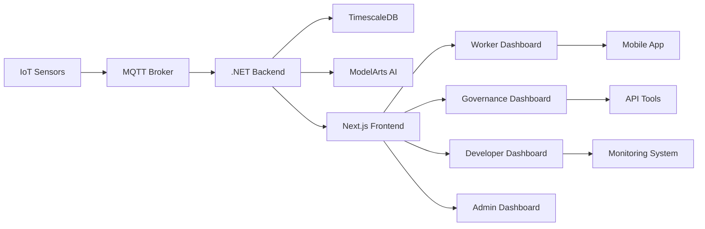

# GridGuard AI - Municipal Grid Protection System

South Africa loses R23 billion annually to electricity theft. Illegal connections cause transformer explosions costing R200k-R500k each. 

**The Problem**: Current meters can't detect "tap-offs" that bypass the meter entirely, and manual audits in high-theft areas put technicians at physical risk.

**Our Solution**: AI-powered sensors detect missing power, neural networks analyze patterns, and smart relays isolate only illegal connections while keeping paying customers powered.

---

## Quick Start

### Prerequisites
- [Docker Desktop](https://www.docker.com/products/docker-desktop/)
- [Node.js 18+](https://nodejs.org/)
- [PowerShell/Terminal](https://docs.microsoft.com/en-us/powershell/)

### 1. Clone & Start
```bash
git clone https://github.com/ShawnTheCreator/gridguardai.git
cd gridguardai

# Start Backend (.NET 9 + TimescaleDB)
cd Backend
docker compose up -d --build

# Start Frontend (Next.js 14)
cd Frontend
npm install
npm run dev
```

### 2. Access System
- **Frontend**: http://localhost:3000
- **Backend API**: http://localhost:5078
- **Admin Dashboard**: http://localhost:3000/admin

---

## Login Credentials

| Role | Email | Password | Dashboard |
|-------|--------|----------|------------|
| **Worker** | `thabo@gridguard.co.za` | `gridguard123` | http://localhost:3000/worker |
| **Governance** | `patrick@gridguard.co.za` | `governance123` | http://localhost:3000/governance |
| **Developer** | `shawn@gridguard.co.za` | `dev123` | http://localhost:3000/dev |
| **Admin** | `admin@gridguard.co.za` | `admin123` | http://localhost:3000/admin |

---

## Architecture

### Technology Stack
| Layer | Technology | Purpose |
|-------|-----------|---------|
| **Frontend** | Next.js 14, React, TypeScript | Real-time dashboard & UI |
| **Backend** | .NET 9, EF Core | API orchestration & business logic |
| **Database** | TimescaleDB, PostgreSQL | Time-series telemetry & analytics |
| **IoT** | Huawei IoTDA, MQTT | Device communication & control |
| **AI** | Huawei ModelArts, CNN-LSTM | Theft detection & pattern analysis |
| **Infrastructure** | Docker, Kubernetes | Container orchestration & deployment |

### System Components
```
┌─────────────────────────────────────────────────────────┐
│                GridGuard AI System              │
├─────────────────────────────────────────────────────────┤
│  🌐 Frontend (Next.js)                    │
│  ├── Worker Dashboard - Field Operations        │
│  ├── Governance Dashboard - Management          │
│  ├── Developer Dashboard - Technical Tools     │
│  └── Admin Dashboard - System Control         │
├─────────────────────────────────────────────────────────┤
│  🔧 Backend (.NET 9)                      │
│  ├── Authentication - JWT & Role Management     │
│  ├── Telemetry API - Real-time Data           │
│  ├── Incident Management - Alert System          │
│  └── Asset Management - Grid Infrastructure   │
├─────────────────────────────────────────────────────────┤
│  🗄️ Database (TimescaleDB)                 │
│  ├── Time-series Telemetry - Sensor Data        │
│  ├── Asset Registry - Grid Components          │
│  ├── Incident Logs - Event History            │
│  └── User Management - Authentication         │
├─────────────────────────────────────────────────────────┤
│  🤖 AI Services (ModelArts)                  │
│  ├── CNN-LSTM - Pattern Recognition           │
│  ├── Anomaly Detection - Theft Identification    │
│  ├── Predictive Analytics - Maintenance       │
│  └── Real-time Validation - Decision Making   │
└─────────────────────────────────────────────────────────┘
```

---

## Key Features

### Real-Time Monitoring
- **Live Telemetry**: 5-second updates from grid sensors
- **Emergency Alerts**: Push notifications for critical events
- **Interactive Maps**: Location-aware grid visualization
- **Performance Metrics**: Real-time system analytics

### Geographic Access Control
- **GPS Location**: Automatic area detection
- **Regional Filtering**: Workers see only assigned areas
- **Boundary Enforcement**: Strict geographic access control
- **Area Assignment**: Johannesburg, Durban, Cape Town coverage

### AI-Powered Detection
- **Pattern Recognition**: CNN-LSTM neural networks
- **Anomaly Detection**: Real-time theft identification
- **Predictive Analytics**: Maintenance forecasting
- **Confidence Scoring**: AI decision reliability

### Field Operations
- **Mobile Responsive**: Optimized for tablets/phones
- **Offline Support**: Full functionality without internet
- **Work Order Management**: Task assignment and tracking
- **Emergency Response**: Quick incident handling

---

## Data Flow



---

## Configuration

### Environment Setup
```bash
# Frontend/.env.local
NEXT_PUBLIC_API_URL=http://localhost:5078
NEXT_PUBLIC_WS_URL=ws://localhost:5078

# Backend/.env
ConnectionStrings__DefaultConnection=Host=localhost;Database=gridguardai;Username=postgres;Password=password
```

### Docker Services
```yaml
# docker-compose.yml
services:
  backend:
    build: ./Backend
    ports: ["5078:80"]
    environment:
      - ASPNETCORE_ENVIRONMENT=Development
      
  frontend:
    build: ./Frontend
    ports: ["3000:3000"]
    environment:
      - NEXT_PUBLIC_API_URL=http://localhost:5078
      
  database:
    image: timescale/timescaledb:latest-pg14
    ports: ["5432:5432"]
    environment:
      - POSTGRES_PASSWORD=password
      - POSTGRES_DB=gridguardai
```

---

## Development

### Project Structure
```
gridguardai/
├── Backend/                    # .NET 9 API
│   ├── Controllers/           # API endpoints
│   ├── Models/               # Data models
│   ├── Data/                 # Database context
│   └── Services/             # Business logic
├── Frontend/                   # Next.js 14 App
│   ├── src/app/             # Dashboard pages
│   ├── src/components/       # UI components
│   ├── src/hooks/           # Custom hooks
│   └── src/lib/             # Utilities
├── Infrastructure/              # Deployment configs
├── Hardware/                   # IoT specs
└── Microservice/              # Additional services
```

### Key Components
- **RealTimeTelemetry**: Live data visualization
- **EmergencyAlerts**: Push notification system
- **LocationAwareMap**: Geographic filtering
- **OfflineModeIndicator**: Connection management
- **useWebSocket**: Real-time streaming
- **useGeolocation**: GPS area assignment

---

## Emergency Response

### Alert Types
- **Theft Detection**: Illegal connection identified
- **Overload Protection**: Excess power draw
- **Outage Detection**: Power loss events
- **Maintenance Required**: Predictive service alerts

### Response Workflow
1. **Detection** → AI identifies unusual pattern
2. **Alert** → Notification sent to field workers
3. **Assignment** → Work order created automatically
4. **Response** → Worker acknowledges and investigates
5. **Resolution** → Incident logged and closed

---

## Analytics & Reporting

### Real-Time Metrics
- **Grid Load**: Total power consumption
- **Asset Health**: Infrastructure status
- **Theft Detection**: AI confidence scores
- **Response Times**: Field operation efficiency

### Historical Analysis
- **Trend Patterns**: Long-term consumption analysis
- **Hotspot Mapping**: High-theft area identification
- **Performance Reports**: System efficiency metrics
- **Incident Analytics**: Response time tracking

---

## Security

### Authentication
- **JWT Tokens**: Secure session management
- **Role-Based Access**: Permission levels
- **API Protection**: Bearer token validation
- **Session Timeout**: Automatic logout

### Data Protection
- **TLS/SSL**: Encrypted communications
- **Input Validation**: SQL injection prevention
- **Rate Limiting**: API abuse protection
- **Audit Logging**: Complete access tracking

---

## Mobile & Offline

### Offline Capabilities
- **Local Storage**: Caches work orders & telemetry
- **Auto-Sync**: Data synchronization on reconnect
- **Manual Sync**: User-triggered updates
- **Connection Status**: Visual indicators

### Mobile Features
- **Responsive Design**: Tablet/phone optimized
- **Touch Interface**: Field operation friendly
- **GPS Integration**: Location-based services
- **Push Notifications**: Real-time alerts

---

## Deployment

### Production Setup
```bash
# Environment variables
NEXT_PUBLIC_API_URL=https://api.gridguardai.co.za
NEXT_PUBLIC_WS_URL=wss://api.gridguardai.co.za

# Build and deploy
npm run build
npm start
```

### Monitoring
- **Health Checks**: `/api/health` endpoint
- **Performance Metrics**: Application analytics
- **Error Tracking**: Comprehensive logging
- **Alert Integration**: Webhook notifications

---

## Documentation

- **Technical Docs**: `/Frontend/docs/TECHNICAL_DOCUMENTATION.md`
- **API Reference**: `/Backend/docs/api-endpoints.md`
- **Deployment Guide**: `/Infrastructure/deployment.md`
- **Troubleshooting**: `/docs/troubleshooting.md`

---

## Contributing

1. Fork the repository
2. Create feature branch (`git checkout -b feature/amazing-feature`)
3. Commit changes (`git commit -m 'Add amazing feature'`)
4. Push to branch (`git push origin feature/amazing-feature`)
5. Open Pull Request

---

## License

This project is licensed under the MIT License - see the [LICENSE](LICENSE) file for details.

---

## Support

- **Documentation**: See `/docs` directory
- **Issues**: [GitHub Issues](https://github.com/ShawnTheCreator/gridguardai/issues)
- **Email**: support@gridguardai.co.za

---

**GridGuard AI - Protecting Municipal Infrastructure with Intelligence** 

---

## Structure
```
gridguardai/
├── backend/
├── frontend/
├── infrastructure/
├── docker-compose.yml
└── README.md
```

---

## Setup

**Requirements**: Docker Desktop, Windows Subsystem for Linux 2 (WSL 2) for Windows users

**Start**:

```bash
git clone https://github.com/ShawnTheCreator/gridguardai.git
cd gridguardai
docker compose up -d --build
```

**Stop**:

```bash
docker compose down
```

**View logs**:

```bash
docker compose logs -f
```

Wait 15 seconds for database initialization.

**Test Endpoints**:

```bash
curl -X POST http://localhost:5078/api/telemetry \
  -H "Content-Type: application/json" \
  -d '{"deviceId": "P-402", "current": 45.5}'
```

**Test Login**:
To test the Next.js frontend or the `/api/auth/login` endpoint, use the following seeded admin credentials:
- **Email:** `thabo@gridguard.co.za`
- **Password:** `gridguard123`

---

## API Endpoints

**Telemetry**:
- `GET /api/poles` - All poles, Global Positioning System (GPS) coordinates, status
- `GET /api/poles/{id}/telemetry/live` - Real-time current/voltage
- `GET /api/poles/{id}/health` - Transformer thermal stress
- `POST /api/telemetry` - Ingest sensor data

**AI & Forensics**:
- `POST /api/forensics/analyze` - Send waveform to ModelArts
- `GET /api/alerts/pending` - Active "Ghost Loads" under review

**Control**:
- `POST /api/control/isolate` - Disconnect specific port
- `POST /api/control/limit` - Trigger 10 Ampere (10A) brownout
- `POST /api/control/restore` - Re-energize line

**Reports**:
- `GET /api/reports/theft-history` - Audit log
- `GET /api/reports/savings-estimate` - Return on Investment (ROI) in South African Rand (ZAR)

---

## Architecture Flow

```
Distribution Pole (Edge)
  ↓ Energy Balance Check
  ↓ MQTT via Huawei IoTDA
.NET 9 Backend
  ↓ Anomaly → ModelArts API
Huawei ModelArts
  ↓ Theft confirmed (93-99%)
  ↓ Command via IoTDA
Smart Relay
  ↓ Scalpel disconnect
Next.js Dashboard
  ↓ Live update via SignalR
```

---
